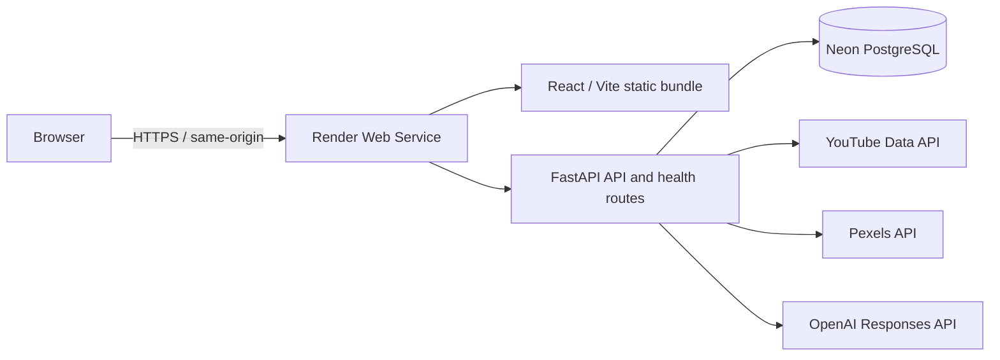

# EditFlow

영상 편집자를 위해 콘텐츠 소재 발굴부터 자료 조사, 프로젝트 전환, 편집 진행 관리까지 하나의 흐름으로 연결하는 콘텐츠 기획·편집 workflow 플랫폼입니다.

## 30초 요약

- **무엇:** 영상 제작의 아이디어, 레퍼런스, B-roll, 체크리스트와 메모를 Project 단위로 연결합니다.
- **시작:** React와 `localStorage`로 편집 자료를 관리하는 1학기 MVP에서 출발했습니다.
- **현재:** FastAPI backend, 인증·멀티유저, server-first workflow, PostgreSQL과 실제 cloud deployment까지 완료했습니다.
- **핵심 과제:** browser-local 데이터를 Backend DB/API 기준 저장소로 전환하고, 소유권 검증(ownership)과 CSRF, 레거시(legacy) 데이터 migration을 설계했습니다.
- **AI:** 직접 학습한 모델이 아니라 OpenAI Responses API를 활용한 LLM application engineering으로 콘텐츠 후보를 생성·검증합니다.
- **상태:** Render + Neon 배포와 HTTPS/auth/CSRF/ownership browser QA, OpenAI production live smoke를 완료한 **EditFlow v1 COMPLETE** 상태입니다.

## Live Demo

**[https://editflow-1utp.onrender.com](https://editflow-1utp.onrender.com)**

Render free tier 특성상 장시간 미사용 후 첫 요청에는 cold start가 발생할 수 있습니다. 이 배포는 전체 production lifecycle과 보안 동작을 검증하기 위한 portfolio deployment이며, 상시 공개 운영과 수익화는 v1 범위가 아닙니다.

## Overview

영상 제작은 편집 프로그램을 여는 순간부터 시작되지 않습니다. 실제 흐름에는 주제 탐색, 아이디어 구체화, 레퍼런스와 B-roll 조사, 작업 계획, 편집 진행이 함께 존재합니다.

EditFlow는 이 과정을 다음과 같이 연결합니다.

```text
소재·주제 탐색
  → 콘텐츠 아이디어 구체화 또는 AI 후보 생성
  → YouTube 레퍼런스 / Pexels B-roll 조사
  → 콘텐츠 아이디어(Content Idea)에 자료 정리
  → 실제 Project로 전환
  → 체크리스트 / 메모 / 진행 상태 관리
  → 편집 작업
  → 최종 업로드 (장기 목표, 현재 미구현)
```

AI 추천은 별도의 데모 기능으로 끝나지 않습니다. 사용자가 선택한 추천을 Content Idea로 저장하고, 조사한 자료와 함께 실제 Project로 전환해 기존 편집 workflow로 이어지도록 설계했습니다.

## Why EditFlow?

영상 제작에서 가장 먼저 생기는 질문은 **"이번에는 어떤 영상을 만들지?"**입니다. 소재를 정한 뒤에도 어떤 레퍼런스를 참고했고, 어떤 B-roll을 골랐으며, 어떤 작업과 메모가 남았는지가 계속 이어집니다.

이 정보는 보통 Windows 폴더, 메모, browser bookmark와 tab, YouTube, 이미지 폴더, 별도 checklist에 나뉘어 저장됩니다. 영상별 폴더만으로 파일은 모을 수 있지만, 하나의 아이디어가 실제 영상 프로젝트로 발전한 과정과 제작 당시의 맥락까지 함께 보기 어렵습니다.

EditFlow는 단순 파일 보관 대신 다음 맥락을 하나의 Project 흐름으로 연결합니다.

- 어떤 소재를 언제 기획했는가
- 어떤 레퍼런스와 B-roll을 선택했는가
- 아이디어가 실제 Project로 어떻게 발전했는가
- 어떤 checklist와 memo를 사용했고 무엇이 남았는가
- 편집 작업이 어느 단계까지 진행되었는가

여기에 AI 콘텐츠 소재 추천을 더해 기획 단계의 **"무엇을 만들지?"**라는 고민부터 지원합니다. 현재는 소재 탐색부터 편집 진행 관리까지 구현되어 있으며, 장기적으로 제작 기간과 업로드 기록까지 연결하는 전체 제작 workflow를 목표로 합니다.

## Project Evolution

### 1학기: React Frontend MVP

첫 버전은 이미 정해진 영상을 편집할 때 필요한 자료 조사와 진행 관리를 돕는 도구였습니다.

- Project 생성·수정·삭제
- YouTube 영상 및 썸네일 검색
- Pexels B-roll 영상·이미지 검색
- 레퍼런스와 B-roll 저장
- 체크리스트와 메모
- 브라우저 `localStorage` 기반 데이터 유지

빠르게 workflow를 검증하는 데는 충분했지만, 데이터가 브라우저에 종속되고 사용자 계정, API key 보호, 실제 데이터 소유권 검증(ownership)을 제공할 수 없다는 한계가 있었습니다.

### 방학: 제품 범위 재정의

프로젝트를 다시 검토하면서 단순한 YouTube/Pexels 검색 도구만으로는 영상 제작 과정 전체를 설명하기 어렵다고 판단했습니다. 편집 이전의 가장 큰 질문은 "무엇을 만들 것인가"이며, 자료 검색 역시 콘텐츠 아이디어와 연결될 때 가치가 커집니다.

이에 목표를 **영상 편집 자료 검색 도구**에서 **콘텐츠 소재 발굴부터 제작 진행까지 연결하는 workflow 플랫폼**으로 확장했습니다. 최종 업로드 자동화는 아직 구현 범위가 아니며, 현재는 아이디어에서 편집 진행 관리까지를 지원합니다.

### 2학기: Backend, AI, Server-first

FastAPI와 DB를 도입해 인증, 사용자별 ownership, Project와 하위 데이터(child resource), Content Idea, 외부 API proxy를 서버 책임으로 옮겼습니다. AI는 콘텐츠 아이디어 후보 생성에 적용했고, 결과를 기존 Project workflow로 연결했습니다.

전환 과정에서 backend와 localStorage가 동시에 상태를 가진 dual-state 복잡성도 경험했습니다. 이를 그대로 유지하지 않고 다음 순서로 정리했습니다.

```text
localStorage MVP
  → backend와 local mapping 공존
  → dual state와 실패 처리의 모호함 발견
  → 정상 Project의 기준 저장소(source of truth)를 Backend DB/API로 전환
  → localStorage를 이전 데이터(legacy data) migration source로 제한
```

## Core Features

| 영역 | 현재 구현 |
| --- | --- |
| Project | 사용자별 생성·조회·수정·삭제, 상태·마감일·진행 정보 |
| 편집 관리 | Project별 체크리스트·메모, 빈 Project에서 선택적으로 생성하는 기본 체크리스트 |
| 레퍼런스 | backend proxy를 통한 YouTube 검색 및 Project/Content Idea 저장 |
| B-roll | backend proxy를 통한 Pexels 영상·이미지 검색 및 저장 |
| Content Idea | 수동 생성, 필터·정렬, 상세 관리, 자료 연결 |
| AI 추천 | 장르·관심사 onboarding, 조건 기반 후보 생성, 선택 저장 |
| Workflow 연결 | Content Idea와 선택 자료를 실제 Project로 transaction 변환 |
| 인증과 격리 | 회원가입·로그인·로그아웃·세션 복원, 사용자별 ownership |
| Legacy migration | local-only Project의 명시적이고 idempotent한 서버 import |

Content Idea를 Project로 전환할 때 Project, 기본 checklist, 초기 memo, 선택한 references/B-roll 복사, 원본 Content Idea relation 갱신을 하나의 transaction으로 처리합니다. 일부만 저장된 중간 상태가 남지 않도록 실패 시 rollback합니다.

## AI Recommendation Design

### 왜 콘텐츠 아이디어 추천인가

개인 프로젝트 범위에서 방대한 학습 데이터와 자체 LLM 인프라를 만드는 대신, 사용자가 편집을 시작하기 전 실제로 고민하는 **콘텐츠 후보 생성**에 pretrained LLM을 적용했습니다.

이 영역을 선택한 이유는 사용자가 장르와 관심사를 명시할 수 있고, LLM이 다양한 후보 생성에 강점이 있으며, 구조화된 결과를 Content Idea와 Project workflow로 연결할 수 있기 때문입니다. 현재 구현은 custom model training이 아니라 **LLM application engineering**입니다.

### 현재 처리 흐름

```text
장르·관심사 onboarding + 사용자 조건
  → FastAPI prompt/context 구성
  → OpenAI Responses API
  → JSON Schema Structured Outputs
  → Pydantic validation / 중복 제거
  → HMAC save_token을 포함한 후보 반환
  → 사용자가 선택한 후보만 DB 저장
```

- OpenAI 호출은 backend에서만 수행하며 provider abstraction 뒤에 위치합니다.
- 기본 5개, 최대 8개의 추천을 요청할 수 있습니다.
- 생성 단계에서는 DB에 쓰지 않고 사용자가 선택한 결과만 저장합니다.
- 장르, 세부 관심사, 주제, 플랫폼, 대상, 형식, 톤, 키워드와 추가 설명을 context로 사용합니다.
- 서버 기준 날짜·월·계절 정보를 prompt에 포함하되, 시기성 소재를 억지로 만들지 않도록 evergreen 후보와 균형을 지시합니다.
- Structured Outputs 뒤에도 Pydantic validation, field limit, 제목 중복 제거를 적용합니다.
- timeout, 사용자별 요청 제한, 동시 생성 방지, live-call opt-in 설정을 둡니다.
- frontend는 `AbortController`, request sequence와 session version을 이용해 취소되거나 늦게 도착한 응답(stale response)이 최신 화면을 덮지 않도록 합니다.

### `save_token`의 역할

추천 생성 API와 저장 API는 분리되어 있습니다. 서버는 추천 필드, `user_id`, `client_key`, 발급·만료 시각을 담은 payload를 HMAC-SHA256으로 서명합니다. 저장 API는 서명, 사용자 binding, TTL을 검증하고 사용된 token의 재사용을 제한합니다.

이는 모든 변조를 막는 포괄적 보안 장치가 아니라, 서버가 실제 발급한 추천만 저장 경로로 인정하여 arbitrary save, token replay, 추천 생성 비용을 우회하는 저장을 제한하는 integrity 및 abuse-control 장치입니다. 현재 replay/rate-limit 상태는 process-local이므로 다중 replica 이전에 공유 저장소 또는 gateway 보완이 필요합니다.

### 시간성과 개인화의 현재 범위

현재는 계절 음식, 계절 여행, 기념일과 같은 시기성을 서버의 prompt context에서만 고려합니다. 별도의 seasonal score나 행동 기반 ranking model이 완성된 상태는 아닙니다.

충분한 사용자 행동 데이터가 없는 상태에서 Random Forest나 Ranking Model을 형식적으로 추가하는 것은 의미가 약하다고 판단했습니다. 향후 `recommendation_shown`, `saved`, `deferred`, `rejected`, `project_created`, `upload_completed` 같은 이벤트가 충분히 쌓이면 다음 구조를 검토할 수 있습니다.

```text
LLM candidate generation
  → seasonal / interest / recent behavior scoring
  → Logistic Regression, Gradient Boosting 또는 Learning-to-Rank 검증
  → Top N personalization
```

이 개인화 계층은 구현된 기능이 아니라 EditFlow v1 이후의 연구·확장 범위입니다.

## Architecture



- Frontend는 화면, 사용자 상호작용, request cancellation과 stale-response 처리를 담당합니다. 인증·세션 상태는 `AuthProvider`와 React Context, domain/API 상태는 custom hooks, 화면에 한정된 상태는 local component state로 관리합니다.
- FastAPI는 인증, ownership, validation, transaction, 외부 provider와 secret을 담당합니다.
- SQLModel이 domain model과 persistence를 연결하고 Alembic이 schema history의 기준입니다.
- YouTube, Pexels, OpenAI key는 browser bundle이 아니라 backend 환경 변수에만 둡니다.
- SQLite는 빠른 local development에 사용하고, production은 Alembic migration을 적용한 Neon PostgreSQL을 사용합니다.
- production에서는 FastAPI가 React build와 `/api`, health route, SPA fallback을 한 Render Web Service에서 제공합니다.

별도 frontend/backend origin에서도 host-only cookie 자체는 가능하지만, cross-site fetch에서는 현재의 `SameSite=Lax` cookie 전송이 제한됩니다. 따라서 v1은 인증·CSRF 구조를 그대로 유지하고 CORS 복잡도를 줄이는 genuine same-origin 구성을 선택했습니다.

Production topology와 PostgreSQL 전환 판단은 [Phase 11-1 Production Architecture](docs/phase-11-1-production-deployment-architecture.md), 운영 경계는 [Phase 11-4 Production Config And Security](docs/phase-11-4-production-config-security.md), 실제 배포 결과는 [Phase 11-5 Actual Deployment](docs/phase-11-5-actual-deployment.md)에 정리되어 있습니다.

## Authentication And Data Ownership

JWT 대신 revocation과 server-side session 제어가 단순한 DB-backed opaque session을 선택했습니다.

- raw session token은 `HttpOnly` cookie에만 저장하고 DB에는 SHA-256 digest를 저장합니다.
- password는 Argon2id로 hash합니다.
- unsafe request는 readable CSRF cookie와 `X-CSRF-Token` header를 비교하고 authenticated session digest에 binding합니다.
- signup/login을 포함한 unsafe request에서 Origin/Referer allowlist를 검증합니다.
- credential CORS는 wildcard가 아닌 명시적 origin만 허용합니다.
- resource 조회는 client가 보낸 `user_id`가 아니라 authenticated `current_user`로 scope합니다.
- 다른 사용자의 resource는 존재 여부를 노출하지 않도록 generic `404`를 반환합니다.

localStorage namespace는 사용자별 legacy data 충돌을 줄이기 위한 compatibility 수단이며 security boundary가 아닙니다. 실제 접근 통제는 backend ownership query가 담당합니다.

## Server-first Data Policy

현재 정상 Server Project의 기준 저장소(source of truth)는 Backend DB/API 하나입니다.

| 데이터 | 정상 runtime | Legacy 호환 |
| --- | --- | --- |
| Project | Backend API/DB | local-only Project import source |
| Checklist / Memo | Backend API/DB | local Project에서만 localStorage |
| Saved Reference / B-roll | Backend API/DB | legacy import 대상만 localStorage |
| Content Idea와 연결 자료 | Backend API/DB | local fallback 없음 |

- canonical Project ID는 backend integer입니다.
- server route는 `/projects/{backendId}`, legacy route는 `/projects/local/{localProjectId}`입니다.
- create/update/delete는 server response가 성공한 뒤에만 UI 성공 상태를 반영합니다.
- API 실패를 local success처럼 처리하거나 server data를 local wrapper로 mirror하지 않습니다.
- `POST /api/projects/import-local`은 Project, checklist와 memo를 한 transaction으로 import합니다.
- `(user_id, source_local_id)` uniqueness를 이용해 최초 요청은 `201`, 동일 import 재시도는 기존 Project를 반환하는 `200`으로 처리합니다.

이 정책을 확정한 과정은 [Phase 10 Stabilization Checkpoint](docs/phase-10-stabilization-checkpoint.md)에서 확인할 수 있습니다.

## Tech Stack

| 영역 | 기술 |
| --- | --- |
| Frontend | React 18, Vite 6, React Router 7, Fetch API |
| State / client logic | React Context와 `AuthProvider`, domain custom hooks, local component state |
| Backend | FastAPI, SQLModel, SQLAlchemy, Pydantic |
| Database | SQLite (local development), Neon PostgreSQL (production), Alembic, Psycopg 3 |
| AI | OpenAI Responses API, Structured Outputs, provider abstraction |
| External APIs | YouTube Data API, Pexels API |
| Security | Argon2id, opaque DB session, HttpOnly cookie, CSRF, explicit CORS |
| Validation | pytest, Node smoke scripts, Vite production build, Headless Edge QA |
| Deployment | Render Docker Web Service, same-origin static/API serving, Neon PostgreSQL |

## Validation And QA

Local regression과 실제 Render + Neon production 환경에서 다음 범위를 확인했습니다.

| 검증 | 결과 |
| --- | --- |
| Backend non-PostgreSQL suite | 386 passed; PostgreSQL 전용 tests 별도 분리 |
| PostgreSQL | Phase 11-3 live suite 통과, Neon fresh DB migration 완료 |
| Python compile / dependency check | `compileall`, `pip check` passed |
| Alembic | one current head, no pending model operation |
| Migration rehearsal | blank SQLite와 development DB copy의 downgrade/re-upgrade passed |
| Data preservation | 확인한 주요 테이블 row count preserved |
| Frontend production build | passed |
| Project API / child / migration smoke | passed |
| Content Idea media smoke | passed |
| Production health | public HTTPS `/health/live`, `/health/ready` 200 |
| Browser core workflow | signup/login/session restore, Project와 child CRUD, conversion, SPA refresh 통과 |
| Cookie / CSRF | Secure·HttpOnly session cookie, readable CSRF cookie, SameSite=Lax와 CSRF flow 확인 |
| Account isolation | production에서 cross-user generic `404` 확인 |
| AI production smoke | OpenAI Responses API 추천 3건, 선택 저장, F5와 Neon persistence 확인 |

Production browser QA는 signup, login, reload 후 session 복원, Project와 child CRUD, Content Idea 변환, logout/relogin, A/B 계정 격리, data persistence와 direct SPA route refresh를 포함했습니다. AI는 제한된 live-call smoke 후 다시 기본 비활성화 상태로 전환했습니다.

실제 배포·production QA 증거는 [Phase 11-5 문서](docs/phase-11-5-actual-deployment.md)에, 이전 로컬 안정화 증거와 알려진 warning은 [stabilization 문서](docs/phase-10-stabilization-checkpoint.md)에 기록되어 있습니다.

## Running Locally

### Prerequisites

- Node.js와 npm
- Python 3.11 이상

### 1. Backend

repository root에서:

```powershell
cd backend
python -m venv .venv
.\.venv\Scripts\Activate.ps1
python -m pip install -r requirements.txt
Copy-Item .env.example .env
alembic upgrade head
uvicorn app.main:app --reload --host 127.0.0.1 --port 8000
```

macOS/Linux에서는 activation과 env 복사 명령을 다음과 같이 바꿉니다.

```bash
source .venv/bin/activate
cp .env.example .env
```

Backend API 문서는 `http://127.0.0.1:8000/docs`, liveness는 `http://127.0.0.1:8000/health/live`, DB readiness는 `http://127.0.0.1:8000/health/ready`에서 확인할 수 있습니다.

### 2. Frontend

새 terminal에서 repository root로 이동합니다.

```powershell
npm install
Copy-Item .env.example .env
npm run dev
```

기본 frontend URL은 `http://127.0.0.1:5173`이고, root `.env.example`의 `VITE_API_BASE_URL`은 local backend `http://127.0.0.1:8000`을 가리킵니다.

### 3. Optional provider configuration

YouTube, Pexels와 AI 추천을 사용하려면 `backend/.env`에 각 provider key를 설정합니다. AI live call은 기본값이 꺼져 있으므로 `LLM_LIVE_CALLS_ENABLED=true`와 충분히 긴 무작위 `LLM_RECOMMENDATION_SIGNING_SECRET`도 필요합니다.

`VITE_` 변수에는 secret을 넣지 않습니다. 실제 `.env`, DB, `node_modules`, `dist`, cache는 Git에서 제외됩니다.

## Test Commands

Backend에서:

```powershell
cd backend
pytest
python -m compileall -q app
python -m pip check
alembic current
alembic heads
alembic check
```

Repository root에서:

```powershell
npm run build
npm run test:project-api
npm run test:project-children
npm run test:project-migration
npm run test:content-idea-media
```

Smoke scripts는 Node의 mock server를 사용하는 frontend contract test이며 live provider API를 호출하지 않습니다.

## Repository Structure

```text
EditFlow/
  src/                  React frontend
    auth/               session restoration and auth state
    components/         feature and UI components
    hooks/              frontend state and request coordination
    pages/              route-level screens
    services/           shared API client and endpoint adapters
    utils/              legacy migration and mapping utilities
  backend/
    app/
      api/              FastAPI routes and dependencies
      core/             settings, engine and shared infrastructure
      models/           SQLModel tables
      providers/        external provider adapters
      schemas/          request/response validation
      services/         ownership, transaction and domain logic
    alembic/             migration environment and revisions
    tests/               pytest suite
  scripts/               frontend contract smoke tests
  shared/                shared default checklist data
  docs/                  architecture and phase decision records
```

`docs/presentation-code-guide.md`는 현재 architecture 설명이 아니라 **1학기 Frontend MVP 발표 기록**으로 보존합니다.

## Design Decisions And Lessons

- **빠른 MVP와 장기 authority를 구분했습니다.** localStorage는 초기에 유효했지만 계정과 서버가 생긴 뒤에는 source of truth가 될 수 없어 server-first로 전환했습니다.
- **실패 상태를 제품 계약으로 다뤘습니다.** API 실패를 local success로 감추지 않고 기존 UI 상태를 유지하도록 mutation 경계를 정했습니다.
- **AI 출력도 외부 입력처럼 검증했습니다.** Structured Outputs만 신뢰하지 않고 Pydantic validation, 중복 제거, 길이 제한과 저장 token 검증을 적용했습니다.
- **AI 기능을 workflow에 연결했습니다.** 추천 텍스트를 보여주는 데서 끝내지 않고 Content Idea 저장과 transactional Project 변환까지 이어지게 했습니다.
- **인증과 ownership을 backend 책임으로 만들었습니다.** browser state가 아니라 `current_user` query가 실제 보안 경계입니다.
- **legacy data를 즉시 삭제하지 않았습니다.** 명시적 route와 idempotent import를 제공해 server-first 전환 중 사용자 데이터를 보존했습니다.
- **데이터가 없는 ML을 과장하지 않았습니다.** 현재 후보 생성은 LLM inference이며, 행동 데이터 기반 ranking은 측정 가능한 데이터가 쌓인 뒤 검증할 계획입니다.

## Current Scope And Roadmap

### 현재 범위

- Phase 7: AI Content Idea recommendation
- Phase 8: Content Idea workflow와 media 연결
- Phase 9: authentication, CSRF, ownership, user-scoped legacy storage
- Phase 10: Project/child server-first 전환과 idempotent legacy migration
- Phase 10 Stabilization: test, migration, browser workflow, repository audit
- Phase 11-1: provider-neutral production/deployment architecture design
- Phase 11-2: dialect-aware engine, UTC datetime, Psycopg와 PostgreSQL offline compatibility
- Phase 11-3: Docker Compose PostgreSQL, live migration, integration/concurrency/browser QA
- Phase 11-4: production fail-fast config, Secure cookie, trusted hosts, health probes, request ID와 DB pool policy
- Phase 11-5: Render + Neon actual deployment, production browser/security/AI smoke, default checklist final polish
- Phase 11-6: repository-wide dead-code audit, minimal cleanup, and v1 freeze

### Phase 11

- **11-2:** SQLite → PostgreSQL code compatibility 완료
- **11-3:** local/dev PostgreSQL과 migration-backed integration test 완료
- **11-4:** production config, Secure cookie, readiness, logging, seed/startup policy 완료
- **11-5:** Render same-origin Web Service와 Neon PostgreSQL 배포, production smoke 완료
- **11-6:** dead code/dependency/env/artifact audit와 전체 regression 완료; v1 baseline 동결

**EditFlow v1: COMPLETE.** Full-stack workflow, 인증과 ownership, server-first 전환, AI recommendation, managed PostgreSQL, HTTPS cloud deployment와 production security QA까지 계획한 v1 범위를 완료했습니다. P0/P1 production blocker는 확인되지 않았습니다.

### v1 이후

- 실제 업로드 단계와 publishing workflow
- 사용자 행동 이벤트 수집과 데이터 품질 기준
- seasonal, interest, recent-behavior score를 이용한 personalization ranking
- 충분한 데이터가 확보된 뒤 ML/ranking model의 baseline 비교
- multi-replica 전 shared rate-limit/save-token replay 저장소 또는 gateway
- PostgreSQL integration의 CI 자동화

현재 non-blocking 한계는 free-tier cold start, 단일 backend process/replica, process-local rate limiting/replay guard, custom domain·Redis·행동 데이터 기반 개인화 미구현입니다. 이는 production lifecycle 검증이라는 v1 목표 밖의 장기 운영·확장 과제입니다.

## Architecture Records

- [Phase 7-1: AI Content Recommendation Design](docs/phase-7-1-ai-content-recommendation-design.md)
- [Phase 9-1: Authentication Architecture](docs/phase-9-1-auth-architecture.md)
- [Phase 10-1: Project Server-first Architecture](docs/phase-10-1-project-server-first-architecture.md)
- [Phase 10 Stabilization Checkpoint](docs/phase-10-stabilization-checkpoint.md)
- [Phase 11-1: Production And Deployment Architecture](docs/phase-11-1-production-deployment-architecture.md)
- [Phase 11-2: SQLite To PostgreSQL Compatibility](docs/phase-11-2-postgresql-compatibility.md)
- [Phase 11-3: PostgreSQL Local And Development Integration](docs/phase-11-3-postgresql-local-integration.md)
- [Phase 11-4: Production Config And Security](docs/phase-11-4-production-config-security.md)
- [Phase 11-5: Actual Deployment And v1 Completion](docs/phase-11-5-actual-deployment.md)
- [Phase 11-6: Final Cleanup And v1 Freeze](docs/phase-11-6-final-cleanup-freeze.md)
- [1학기 Frontend MVP 발표 코드 가이드](docs/presentation-code-guide.md) - historical document
