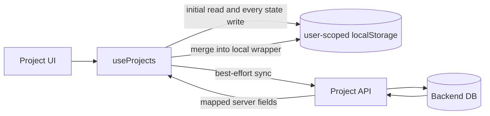
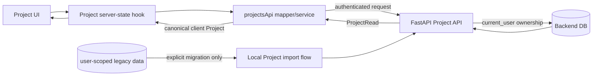

# Phase 10-1: Project server-first architecture

## 0. Scope and non-goals

This phase is a code-backed investigation and architecture decision only. It does not change frontend runtime code, backend runtime code, the database schema, or Alembic history. The target of Phase 10 is to make the authenticated Project API and database the single authoritative source for normal Project operations while preserving legacy/local-only data until an explicit migration succeeds.

Terminology in this document is intentionally strict:

- **Legacy local import**: Phase 9-6 copy from global browser keys into one user's scoped browser keys.
- **Local Project sync**: explicit upload of a local-only Project and attributable child data to the backend.
- **Server Project recovery**: current Phase 8-2 operation that creates a local wrapper for an already existing server Project.
- **Server-first migration**: changing normal Project reads and writes from localStorage authority to backend authority.

## 1. Final architecture decisions

1. A normal Project is a backend entity identified by its positive integer backend ID.
2. `GET /api/projects` and `GET /api/projects/{id}` are authoritative for list and detail respectively.
3. Create, update, and delete use confirmed/pessimistic mutations: UI success is applied only after the API succeeds.
4. A server Project's frontend model uses `id`, not a second `backendProjectId` alias.
5. Legacy local-only Projects remain in a separate compatibility data set and route until explicitly migrated. They are never silently uploaded or deleted.
6. The application does not use stale Project localStorage as an offline fallback. An API failure renders loading/error/retry state.
7. At every point there is one authoritative source per entity. A server Project is never authoritatively dual-written to localStorage.
8. Existing Phase 9 ownership, session, CSRF, and cross-user 404 behavior remains unchanged.
9. No React Query/SWR, Axios, datetime library, offline queue, or conflict engine is needed for Phase 10.

## 2. Current frontend Project inventory

| Area | Current code | Current dependency |
| --- | --- | --- |
| Project state and CRUD | `src/hooks/useProjects.js` | User-scoped `projects` localStorage array is initialized first and persisted after every state change |
| API and mapper | `src/services/projectsApi.js` | CRUD endpoints exist; server response is mapped and merged into a local wrapper |
| Project list | `src/pages/ProjectListPage.jsx` | `useProjects()` local array, client-side search, local migration and server recovery controls |
| Project card/route | `src/components/projects/ProjectCard.jsx` | Local string `project.id`; deadline/status/count aliases |
| Project detail | `src/pages/ProjectDetailPage.jsx` | Resolves route only by searching the local array; it does not fetch detail by route ID |
| Project selection | `src/hooks/useProjectSelection.js` | Query parameter contains local string ID and resolves against the local array |
| Create/edit form | `src/components/projects/ProjectForm.jsx` | title, description, deadline, display-status; client name is not exposed |
| Dashboard | `src/hooks/useDashboardSummary.js` | Static `public/data/dashboard-summary.json`, not local Projects and not the backend |
| Local → server sync | `src/utils/projectMigration.js` | Sequential POST per local-only Project; partial progress stored locally |
| Server → local recovery | `src/components/projects/ServerProjectImportDialog.jsx`, `src/utils/serverProjectRecovery.js` | Explicitly fetches server list/detail, then creates a new random local wrapper |
| User storage/legacy import | `src/utils/userStorage.js` | Scoped Project key and explicit global legacy import; imported backend mappings are invalidated |
| Content Idea conversion | Content Idea pages/hooks and `contentIdeasApi.js` | Backend creates Project transactionally; frontend then registers a local wrapper before navigation |
| Child resources | checklist, memo, saved media hooks | API for linked Projects, browser storage/sample data for local-only Projects |

## 3. Current data flow



### 3.1 Create

1. `ProjectForm` returns a display-oriented object.
2. `useProjects.addProject` immediately creates a random local string ID and inserts a `syncing` Project into React/localStorage.
3. It then POSTs `/api/projects`.
4. Success adds `backendProjectId` and merges server fields into the same local object.
5. Failure retains the apparently created local Project as `sync_failed`.

This is optimistic local-first creation and directly violates the target contract that a failed DB write must not appear as a successful Project creation.

### 3.2 List

1. `useProjects` renders user-scoped localStorage (or bundled sample Projects) immediately.
2. On mount it calls `GET /api/projects`.
3. The response only refreshes local entries that already have a matching `backendProjectId`.
4. Server-only Projects are not added automatically; they require the recovery dialog.
5. A missing linked server Project is retained locally with `sync_failed`.

Therefore the backend list is currently reconciliation input, not list authority.

### 3.3 Detail

`/projects/:projectId` is resolved by `projects.find(item.id === routeProjectId)`. The route key is a local string and detail does not call `GET /api/projects/{backendId}`. Refresh works only if the same local wrapper is still in that browser namespace.

### 3.4 Update

- Local-only Project: updates local state/storage immediately and never calls the API.
- Linked Project: marks only sync metadata first, PATCHes the backend, then merges the response. Failure restores the old local fields.
- There is no durable offline edit queue or genuine unsynced field delta for an already linked Project.

One mapper issue matters during transition: `mergeBackendProject` prefers an existing local display `status` over the returned server status. A server refresh can therefore retain stale presentation state.

### 3.5 Delete

- Local-only Project: immediately deletes the local Project, checklist, and memo data.
- Linked Project: DELETEs the backend first, then removes the local wrapper/checklist/memo.
- Current 404 handling also removes the local wrapper and its related local data as if deletion succeeded.

The backend deletion itself is transactional: it deletes checklist items, Project saved references, Project saved B-rolls and memos, and resets linked Content Ideas to `ready` with no `converted_project_id`.

### 3.6 Dashboard

The three Dashboard values are static JSON. They are neither computed from the local Project array nor loaded from a Project summary endpoint. This must be replaced during the read-path transition.

### 3.7 Content Idea conversion

The backend already performs the strong part correctly: conversion creates the Project and selected checklist/memo/media setup within the conversion transaction and returns `ProjectRead`. The frontend then creates a local wrapper with a random ID and navigates to that local route. If local registration fails after the backend commit, the Project exists but the UI requires server recovery.

### 3.8 Imported and unsynced Projects

Phase 9-6 strips legacy `backendProjectId`, so imported Projects are intentionally local-only. Existing user-scoped local-only Projects may also have `sync_failed` from a failed create or no mapping from older phases.

## 4. Frontend versus backend schema

The target client shape should be the direct camelCase representation of `ProjectRead`:

```text
{
  id: number,
  title: string,
  description: string,
  clientName: string,
  status: "planning" | "in_progress" | "completed" | "archived",
  dueDate: "YYYY-MM-DD" | "",
  createdAt: ISO datetime,
  updatedAt: ISO datetime,
  referenceCount: number,
  brollCount: number,
  checklistTotal: number,
  checklistCompleted: number
}
```

| Meaning | Current frontend local/wrapper | Backend `ProjectRead` | Target decision |
| --- | --- | --- | --- |
| Identity | `id: string`, `backendProjectId?: int` | `id: int` | Server Project uses `id: int`; local ID exists only on a legacy type |
| Owner | optional mapped `userId` | `user_id: int` | Backend decides owner; client does not send it and UI need not retain it |
| Title | `title` | `title` | Same semantic field |
| Description | `description` | `description` nullable | Mapper may expose empty string for forms |
| Client | `client`/`clientName` aliases | `client_name` | Backend supports it, but current Project form does not expose it |
| Status | arbitrary Korean display string plus `backendStatus` | four-value enum | Client canonical value is backend enum; labels belong in presentation helpers |
| Due date | `deadline` and `dueDate` | `due_date` | Client canonical value is `dueDate`; remove `deadline` alias after consumers migrate |
| Created | local date-only `createdAt`; linked `serverCreatedAt` | timezone-aware `created_at` | Server datetime is canonical; remove `serverCreatedAt` alias |
| Updated | sometimes `updatedAt` | `updated_at` | Server datetime is canonical |
| Counts | `referenceCount`, `brollCount`, `checklistDone`, `checklistTotal` | reference/broll/total/completed counts | Keep mapped counts; rename `checklistDone` consumer to `checklistCompleted` |
| Sync metadata | `syncStatus`, `lastSyncError` | none | Only meaningful on the legacy compatibility model; remove from server Project model |

The backend Project schema already represents every core Project field used by the current form/cards. No Project column is required for normal server-first CRUD. Thumbnails and current local-only sample panels are not Project columns and should not drive Project schema expansion.

## 5. ID and route strategy

### Options considered

**A. Keep the local string route ID for server Projects**

- Advantage: fewer immediate component changes and old same-browser links keep working.
- Cost: every browser still needs a local mapping; direct links and clean profiles fail; recovery remains necessary; two IDs remain throughout the app.

**B. Use the backend ID for server Project routes**

- Advantage: stable cross-browser URLs, direct detail fetch, no mapping dependency, simpler child-resource calls, and natural alignment with backend ownership.
- Cost: route and query-selection consumers must migrate, and local-only Projects need an explicit compatibility route.

### Decision

Choose **B**.

- Normal server route: `/projects/:projectId`, where `projectId` must parse to a positive safe integer.
- Transitional local route: `/projects/local/:localProjectId` for preserved local-only Projects.
- Search-page destination query parameters use the backend Project ID for server Projects.
- During compatibility cleanup, an old `/projects/{localString}` link may look only in the current user's legacy data. If it has a valid mapping, redirect to `/projects/{backendId}`; otherwise redirect to the local-only route. Never scan another user's namespace.

This route split also gives components a clear discriminant instead of repeatedly inferring mode from `backendProjectId`.

## 6. Current localStorage inventory and final role

| Scoped resource | Current role | Server-first direction |
| --- | --- | --- |
| `projects` | Normal Project authority plus local-only and linked wrappers | Keep only as the explicit legacy/local-only migration source; do not write new normal server Projects |
| `checklist` | `{localProjectId: item[]}` for local-only Projects | Keep until that local Project is migrated; new server Projects use API only |
| `project-memos` | `{localProjectId: memo[]}` for local-only Projects | Same transitional policy as checklist |
| `saved-references` | Flat array saved by local Project UI | Preserve, but it lacks Project association and cannot be automatically assigned during migration |
| `saved-brolls` | Flat array saved by local Project UI | Preserve, but it lacks Project association and cannot be automatically assigned during migration |
| `legacy-import-status` | Phase 9-6 import completion marker | Keep; unrelated to normal server Project reads |

For unsynced Project detail, checklist and memos genuinely use keyed local data. References/B-roll are weaker: the save buttons write flat per-user arrays without `projectId`, while unsynced Project detail displays bundled sample data rather than those saved arrays. Phase 10 must not pretend those media records are attributable to a specific Project.

No cache/offline framework should be introduced. Once all local-only migrations are explicitly resolved, old scoped records can be removed only through a separately confirmed cleanup operation.

## 7. Target server-first data flow



The implementation can remain a small custom hook. A new data library is unnecessary. The hook contract should expose:

```text
projects, isLoading, error, refetch,
createProject, updateProject, deleteProject,
creating, updatingIds, deletingIds
```

It must clear or replace Project state when authenticated user identity changes, abort superseded requests, and guard duplicate mutations as current hooks already do.

## 8. Target read contracts

### 8.1 Project list

1. Mount/auth user change → clear prior user data and enter loading.
2. `GET /api/projects`.
3. Success → replace the server Project list, including an empty array.
4. 401 → existing AuthProvider invalidation.
5. Network/5xx → error plus retry; do not show localStorage as if authoritative.

The backend list already returns reference, B-roll, checklist total and checklist completed counts using aggregate subqueries. It does not issue per-Project child queries, so there is no N+1 blocker.

### 8.2 Project detail

Parse the route as a positive integer and call `GET /api/projects/{id}`. Detail has independent `loading`, `notFound`, `error`, and `project` states. A list state may be used as a display optimization, but it must not replace the detail request contract.

### 8.3 Dashboard

Use the same `GET /api/projects` result and derive the current three cards in one frontend pass:

- active Project count from an explicitly agreed status set (recommended: `planning` + `in_progress`),
- sum of `referenceCount`,
- sum of `checklistCompleted`.

No new summary endpoint is required for the current three metrics. If Dashboard semantics later diverge or pagination is introduced, a dedicated backend summary can be designed then. The current static JSON must be retired from authenticated Dashboard data.

## 9. Target mutation contracts

### 9.1 Create

```text
submit → disable form → POST /api/projects → receive ProjectRead
       → insert/refetch canonical server Project → navigate /projects/{id}
```

On failure, keep the form open, preserve entered values, show the error, and create no local-only fallback. No local Project appears before 201.

### 9.2 Update

Disable the relevant mutation control, PATCH the backend, then replace the matching server Project with the returned `ProjectRead`. On failure, keep the last confirmed server representation and show the error. The status should be the server enum, with Korean labels applied only while rendering.

### 9.3 Delete

Confirm → DELETE backend → on 204 remove from UI or refetch → navigate if on detail. On failure, retain the UI Project. Frontend must not separately simulate deletion of server children; the backend transaction owns Project-child deletion and Content Idea restoration.

For a normal server route, 404 means not found/hidden and does not mutate legacy data. The current “404 equals successful local cleanup” branch must be removed from the server path.

## 10. Error policy

The existing `apiClient` remains the transport contract:

- credentials are included,
- unsafe methods receive CSRF,
- one CSRF refresh/retry is supported,
- 401 notifies AuthProvider,
- `ApiError` carries status and metadata.

Project UI policy:

| Error | UI behavior |
| --- | --- |
| 401 | AuthProvider signs out; protected-route intended-destination behavior remains |
| 404 | Detail not-found state; mutation reports missing Project and refreshes server list if useful |
| 400/422 | Keep form open and display validation feedback |
| 409 | Reserved for import/idempotency or later concurrency contracts; present a recoverable conflict message |
| Network/5xx | Error/retry; never substitute stale local Projects as authoritative |

## 11. Date/time and mapper contract

- `due_date` is a calendar date and maps to `dueDate` in `YYYY-MM-DD`; do not construct a local-time midnight for storage.
- `created_at`/`updated_at` remain ISO datetimes and are formatted at the presentation boundary with built-in `Intl`.
- Existing D-day calculation already parses date parts and compares calendar days; retain a pure date-based test around timezone boundaries.
- `mapBackendProject` remains the single snake_case → camelCase boundary.
- Components must not directly translate backend payloads.
- Remove `deadline`, `backendStatus`, `serverCreatedAt`, and `checklistDone` aliases only after their listed consumers are migrated in the same implementation phase.

## 12. Legacy local-only Project strategy

Automatic upload is forbidden. The rollout must expose local-only Projects separately, for example a “이 브라우저의 이전 프로젝트” section with an explicit “서버에 저장” action.

The safe contract is:

1. Read only the authenticated user's scoped legacy Project and keyed child data.
2. User explicitly selects one Project and reviews the upload scope.
3. Submit an idempotent import request.
4. On complete backend success, refetch the server list and route to `/projects/{backendId}`.
5. Mark that local record as migrated or store its mapping for compatibility; do not delete the original automatically.
6. On failure or ambiguous network outcome, preserve every local source value and allow retry/status recovery.

The existing sequential `POST /api/projects` migration is not fully safe for ambiguous failures: if the server commits but the response is lost before local mapping is stored, retry can create a duplicate. It also does not migrate memos/references/B-roll and migrates checklist separately.

### Required import contract before final local migration

Provide a dedicated transactional, idempotent local import contract rather than extending normal Project create with dual-write behavior. A recommended shape is:

```text
POST /api/project-imports/local
{
  source_local_id,
  project,
  checklist_items,
  memos
}
```

The backend must scope `source_local_id` to `current_user`, return the existing result on retry, and commit Project plus attributable children atomically. This likely needs a small import receipt or nullable source key with a unique `(user_id, source_local_id)` constraint. The exact persistence choice is a Phase 10-5 design/DB migration decision, not a Phase 10-2 read-path blocker.

Because the current local saved Reference/B-roll arrays have no Project association, they must be excluded from automatic Project import. Preserve them as unassigned legacy media or add a later manual assignment UX; guessing a destination would be destructive.

## 13. Synced local Project strategy

Current linked wrappers do not contain a durable queued edit delta. Their normal updates are sent to the backend immediately, and failures restore prior fields. Therefore:

- if `backendProjectId` resolves for the current user, discard the wrapper's copied core fields and use `ProjectRead` as authoritative;
- retain only a temporary old-local-ID → backend-ID redirect mapping if old links need compatibility;
- do not merge local title/status/deadline over server values;
- do not create a conflict engine for fields that are not actually queued offline.

Concurrent browser edits remain last-confirmed-write-wins under the current PATCH contract. `updated_at` is available for a later conditional-write design, but ETags/version columns are not required to complete the current server-first scope.

## 14. Stale `backendProjectId` strategy

A foreign/deleted/stale mapping returns 404 due to Phase 9-5 ownership. Do not delete the local record or local children automatically.

1. Mark only the compatibility mapping as stale in UI memory/local metadata.
2. Preserve the local snapshot.
3. Explain that the linked server Project is unavailable.
4. Offer explicit choices: keep as a local legacy Project, or import it as a new Project through the idempotent local import flow.
5. Never probe another user ID or send `user_id` to claim ownership.

Once normal routes use backend IDs, this strategy is limited to legacy migration/old-link compatibility rather than ordinary Project detail.

## 15. Child-resource impact

| Resource | Current dual mode | Server-first normal Project | Legacy migration requirement |
| --- | --- | --- | --- |
| Checklist | API when linked; keyed local arrays otherwise | API only | Existing per-item migration is non-atomic and can become blocked after partial failure; include in transactional local import or redesign resumability |
| Memo | API when linked; keyed local arrays otherwise | API only | No current local → server migration exists; include attributable memos in import |
| Saved Reference | API when linked; flat local array otherwise | API only | No reliable local Project association; preserve/unassigned/manual assignment |
| Saved B-roll | API when linked; flat local array otherwise | API only | Same as Reference |

Newly created server-first Projects always have a backend ID before users enter child-resource screens, so their checklist, memo and media hooks can use API-only mode. Transitional dual mode remains solely inside `/projects/local/:localProjectId` and its explicit migration UI.

The backend already has list/create/update/delete endpoints for all four child types. No new endpoints are needed for normal Project usage. Batch/transactional behavior is needed only for robust legacy import.

## 16. Content Idea conversion impact

Target flow:

```text
conversion submit
→ POST /api/content-ideas/{id}/convert-to-project
→ backend transaction creates Project + selected setup and relation
→ returned ProjectRead updates/refetches server Project state
→ navigate /projects/{project.id}
```

Remove `registerBackendProject` and `restoreServerProject` from conversion success. The source relation stays backend-authoritative through `converted_project_id` and `/api/projects/{id}/source-content-idea`. No duplicated local relation is needed.

Backend deletion behavior already restores the linked idea and removes Project-owned copied children while preserving the idea's own media records, which matches the target ownership boundary.

## 17. Server recovery workflow disposition

Current entry points are the Project list “server projects import” dialog and Content Idea relation recovery buttons. They exist only because server Projects do not automatically appear without local wrappers.

- Phase 10-2: normal server list/detail makes recovery unnecessary for discovery, but keep the old wrapper/redirect code temporarily for compatibility.
- Phase 10-3: conversion and Project creation navigate directly by backend ID; stop creating recovery mappings.
- Phase 10-4: remove the visible server recovery dialog and Content Idea recovery buttons after their server-first replacements pass QA.
- Phase 10-5: remove dead `createRecoveredLocalProject`, `registerBackendProject`, restore locks/errors and mapping-only CSS/tests after legacy redirects/migration no longer call them.

Do not delete recovery code in Phase 10-1.

## 18. Source-of-truth and anti-dual-write rules

1. Backend `ProjectRead` is the only authority for a server Project.
2. A successful POST/PATCH/DELETE response is the only normal Project mutation success signal.
3. React state is a view cache, not a second persistence system.
4. Project localStorage is read only by legacy compatibility/migration code after the read-path transition.
5. New server Projects are never written into the scoped `projects` key.
6. Legacy source data is never automatically changed because a server request was attempted.
7. Child-resource authority follows Project kind: server Project → API; legacy local Project → its preserved scoped keys until migration.
8. No code path sends `user_id`; the backend derives ownership from the session.

## 19. API and schema gap analysis

### Already sufficient for normal server-first behavior

- `GET /api/projects`
- `GET /api/projects/{id}`
- `POST /api/projects`
- `PATCH /api/projects/{id}`
- `DELETE /api/projects/{id}`
- Project response child counts
- Project source Content Idea lookup
- Authenticated ownership and cross-user 404
- Transactional Project deletion and Content Idea restoration
- Child-resource CRUD endpoints

There is no `/api/projects/summary`, but it is not currently required because list responses already include the three Dashboard inputs in one aggregate query.

### Gaps limited to legacy migration

- idempotent local import identifier/receipt,
- atomic Project + attributable checklist + memo import,
- import status recovery after an ambiguous network response,
- an explicit policy/UI for unassigned legacy Reference/B-roll.

No normal Project schema change is required. A minimal migration-specific table/column is likely needed only when implementing the robust import contract.

## 20. Phase 10 staged implementation plan

### Phase 10-2 — server-first reads and IDs

- Introduce canonical server Project mapper/type conventions.
- Add server list and independent detail hooks with loading/error/retry/not-found.
- Change list, detail, selectors and Dashboard to backend data.
- Use backend integer route/query IDs.
- Display local-only Projects in a separate compatibility section/route.
- Add old local route redirect logic without deleting mappings.
- Keep mutations/recovery compatibility where required, but do not write server reads back to localStorage.

Exit condition: clearing localStorage or using a clean browser still shows the same authenticated server Projects after refresh.

### Phase 10-3 — server-confirmed Project mutations

- Create only after POST 201; keep form open on failure.
- Update only from returned PATCH response.
- Delete UI only after 204; remove 404 local cleanup behavior.
- Remove normal Project localStorage writes and local optimistic fallback.
- Navigate create/edit/conversion flows by backend ID.

Exit condition: failed API mutations never appear successful and no new normal Project wrapper is written.

### Phase 10-4 — child resources and conversion cleanup

- Make child hooks API-only on server routes.
- Isolate local child mode under the legacy route.
- Refetch/update Project aggregate counts after child mutations.
- Remove conversion local registration and visible server recovery UX.
- Replace unsynced Project sample media with truthful legacy states.

Exit condition: every newly created Project and its child resources work across refresh/clean browser without localStorage.

### Phase 10-5 — explicit legacy migration and dead-code cleanup

- Implement idempotent transactional import contract and minimal migration schema if approved.
- Import attributable Project/checklist/memo data; preserve unassigned media.
- Handle stale mappings without destructive cleanup.
- Complete A/B and failure-injection QA.
- Offer separately confirmed local cleanup, then remove obsolete migration/recovery/wrapper code.

Exit condition: all user decisions are preserved, successful imports are retry-safe, and backend DB is the only normal Project authority.

## 21. Test inventory and implementation test plan

Current backend coverage is strong:

- `tests/test_projects.py`: 14 Project CRUD, aggregate, validation and ownership tests.
- `tests/test_multi_user_ownership.py`: Project/children/conversion cross-user isolation.
- Checklist, memo, Reference and B-roll suites cover Project scoping, missing resources and deletion.
- Content Idea conversion suites cover atomic setup, rollback, relation restoration and reconversion.
- Reported full baseline: 314 passed.

Frontend has no test framework. Phase 10 should keep pure logic extractable and test it with temporary Node smoke scripts where valuable:

- strict backend Project ID parsing,
- server mapper and status labels,
- Dashboard aggregation,
- old local route → backend/local route resolution,
- local-only classification and stale mapping decisions,
- import payload transformation/idempotency behavior.

Do not add a new test framework solely for this transition.

## 22. Browser QA plan

### Persistence and clean-browser proof

1. Login as A, create a Project and wait for confirmed success.
2. Refresh: Project remains.
3. Clear EditFlow localStorage or use a clean profile, login as A: the same Project appears.
4. Update and refresh: server value remains.
5. Delete and refresh: Project remains absent.

### Multi-user proof

1. A creates Project A; B creates Project B.
2. A list/detail/search selectors show only A.
3. B shows only B, even with A's local keys present in the browser.
4. Cross-user integer routes return not found without existence disclosure.

### Legacy proof

1. Seed a scoped local-only Project with checklist/memos and unassigned media.
2. Confirm it remains visible only in the legacy section after server-first reads launch.
3. Cancel import: no backend or local mutation.
4. Successful explicit import: server route appears; local source remains until separate cleanup.
5. Inject network/commit/response-loss failures: no data loss and retry does not duplicate.
6. Stale mapping 404: local snapshot remains and no automatic delete occurs.

### UI states

Verify list/detail loading, empty, retryable error, 404, disabled mutation controls, form-value retention and responsive layouts at 360, 768 and 1280 px.

## 23. Rollback and data-preservation principles

- Read-path rollout can be reverted without transforming/deleting scoped local data.
- Mutation rollout must not remove compatibility data until server confirmation.
- Legacy import writes a durable idempotent receipt only in the same successful backend transaction as imported data.
- A client-side success marker is written only after a verifiable server result.
- Cleanup is a later, explicit, independently confirmed action.
- Rollback never depends on reconstructing local data from server projections.
- No rollout phase deletes legacy global or user-scoped data automatically.

## 24. Security and cross-user behavior

The frontend sends Project IDs and data fields, never an owner ID. `CurrentUserDependency` and service queries scope list/detail/mutations by the authenticated user. Another user's resource is returned as 404, including children and source relations. Server-first reduces accidental same-browser mixing because normal data no longer depends on browser namespaces, but localStorage remains only a UX boundary for legacy data—not an authorization boundary.

## 25. Decisions fixed for implementation

- Backend integer IDs for normal Project routes.
- Separate explicit legacy-local route and model.
- Confirmed mutations; no normal offline/local fallback.
- Server enum as canonical status.
- `dueDate` and `checklistCompleted` as canonical client field names.
- `GET /api/projects` supplies list and current Dashboard aggregates.
- Server wins for every linked wrapper because there is no real queued linked-project delta.
- 404 never triggers destructive legacy cleanup.
- Recovery workflow is retired after server-first list/detail/conversion replace it.
- Reference/B-roll without Project association are preserved but not auto-imported.

## 26. Blockers to resolve before implementation phases

No blocker prevents Phase 10-2 server-first reads or Phase 10-3 normal mutations. Before Phase 10-5 legacy import, these decisions/contracts must be implemented:

1. Backend persistence for a current-user-scoped idempotent `source_local_id`.
2. Transaction boundary and payload limits for Project + checklist + memo import.
3. Product UX for flat, unassigned legacy Reference/B-roll data.
4. Exact Dashboard “진행 중” status definition (`planning + in_progress` is recommended).
5. Duration of old local-string URL compatibility before dead-code removal.

## 27. Phase 10-1 verification and state

- Git working tree was clean at start; latest commit was `abe3720 feat: isolate local storage by authenticated user`.
- Alembic head remains `e7b2a9c41d60`.
- Runtime code changed: 0 files.
- Backend/schema/migration changed: 0 files.
- External/OpenAI/YouTube/Pexels calls or changes: 0.
- This phase intentionally does not run pytest or the Vite build because the only repository change is this document.
